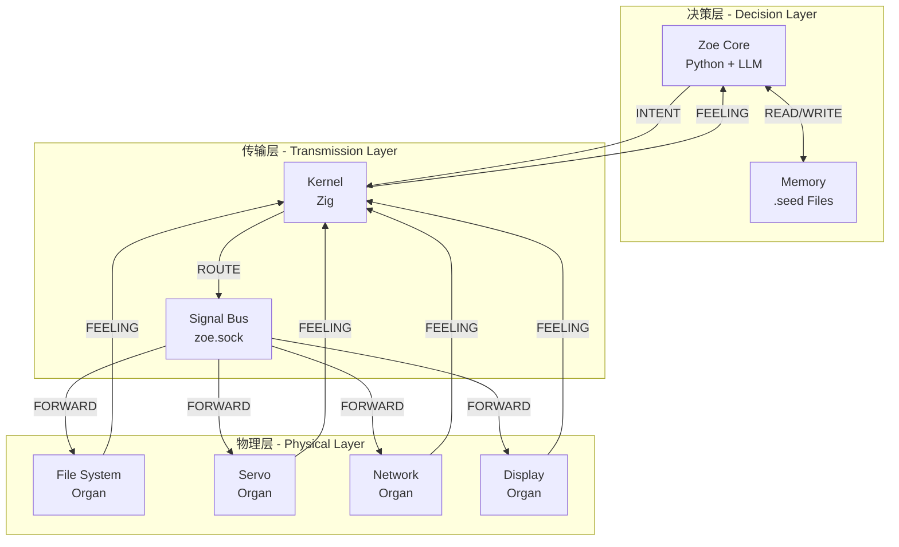
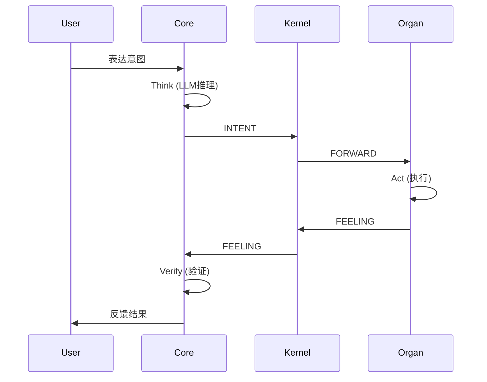
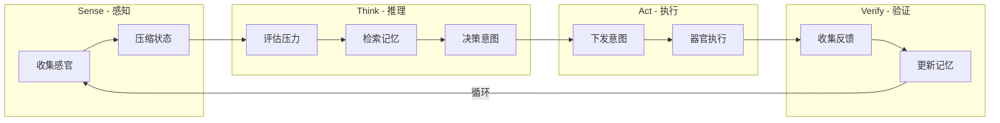

# 🏗️ Zoe-OS 系统架构

## 整体架构图



## 认知循环



## 组件交互



## 目录结构

```
zoe-os/
├── core/                    # 决策层
│   └── zoe.py              # 认知引擎核心
│
├── kernel/                  # 传输层
│   ├── boot.zig            # 系统引导
│   └── pulse.zig           # 信号总线
│
├── organs/                  # 物理层 (器官)
│   ├── fs.zig              # 文件系统器官
│   ├── servo.zig           # 舵机器官
│   └── network.zig         # 网络器官
│
├── .seed/                   # 记忆层
│   ├── core.seed           # 核心记忆
│   └── YYYY-MM-DD.seed     # 每日经验
│
├── spec/                    # 规范文档
│   ├── MANIFESTO.md        # 设计宣言
│   ├── PBM.md              # 四层架构
│   ├── SIGNAL.md           # 信号协议
│   ├── ACTUATOR.md         # 执行器标准
│   └── ARCHITECTURE.md     # 本文档
│
├── tools/                   # 工具
│   └── top.py              # 系统监控
│
└── tests/                   # 测试
    ├── test_core.py
    └── test_kernel.zig
```

## 数据流

### 1. 意图下发流程

```
用户输入 → LLM推理 → 生成INTENT → Kernel路由 → 目标器官执行
```

示例：

```json
用户: "整理桌面"
  ↓
LLM: {"intent": "ORGANIZE", "target": "fs", "params": {"path": "~/Desktop"}}
  ↓
Kernel: 路由到 fs-01 器官
  ↓
fs-01: 执行文件整理
```

### 2. 感官上报流程

```
器官状态变化 → 压缩为FEELING → Kernel转发 → Core评估 → 更新记忆
```

示例：

```json
fs-01: 检测到磁盘空间紧张
  ↓
FEELING: {"pressure": 0.7, "summary": "磁盘空间紧张"}
  ↓
Core: 记录到 .seed，可能触发清理意图
```

### 3. 心跳机制

```
器官 → Kernel: BEAT (每5秒)
Kernel: 更新器官状态
超时 → 标记离线 → 通知Core
```

## 关键设计决策

### 为什么用 Zig 写内核？

1. **性能**：零成本抽象，接近 C 的性能
2. **安全**：编译时内存安全检查
3. **简洁**：无隐藏控制流，代码透明
4. **跨平台**：支持嵌入式到桌面

### 为什么用 Python 写大脑？

1. **生态**：丰富的 AI/LLM 库
2. **灵活**：快速迭代，易于扩展
3. **可读**：代码即文档，透明性原则

### 为什么用 Unix Socket？

1. **低延迟**：本地 IPC 最优选择
2. **简单**：无需配置，开箱即用
3. **可靠**：内核级缓冲，不丢消息

## 扩展机制

### 添加新器官

1. 实现 `organ_interface`:

   - `register()` - 注册到总线
   - `execute(intent)` - 执行意图
   - `heartbeat()` - 发送心跳

2. 连接 `zoe.sock`

3. 发送 REGISTER 信号

### 添加新能力

1. 在器官中实现新 action
2. 更新 REGISTER 信号的 actions 列表
3. Core 自动发现新能力

## 性能指标

| 指标     | 目标值  | 说明                       |
| -------- | ------- | -------------------------- |
| 意图延迟 | < 100ms | 从意图生成到器官接收       |
| 感官延迟 | < 50ms  | 从器官状态变化到 Core 感知 |
| 心跳间隔 | 5s      | 器官存活检测               |
| 故障恢复 | < 30s   | 从器官崩溃到恢复服务       |

## 安全模型

### ACL 控制

```json
{
  "organ_id": "fs-01",
  "permissions": {
    "paths": ["~/Documents", "~/Desktop"],
    "actions": ["READ", "WRITE", "DELETE"]
  }
}
```

### 意图验证

- Kernel 验证意图格式
- Organ 验证权限范围
- Core 验证结果一致性

---

_Architecture is about the important stuff. Whatever that is._  
— Ralph Johnson
